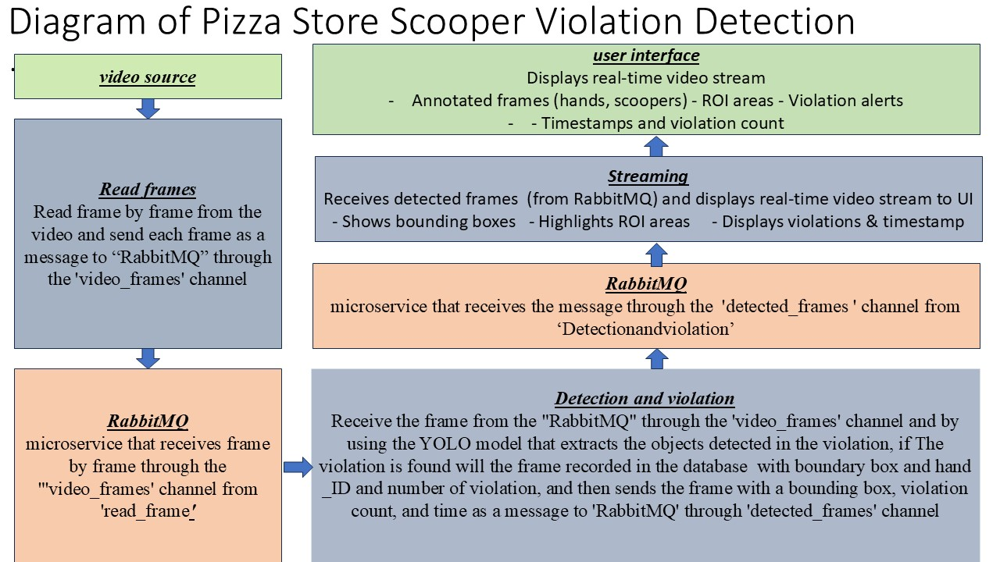

# Pizza Store Scooper Violation Detection 
### Overview
 - This project is focused on building a Computer Vision system for a pizza store to monitor hygiene protocol compliance. Specifically, the system detects whether workers are using a scooper when picking up certain ingredients (like proteins) from designated areas (**ROIs** - ***Regions of Interest***). Any action of picking up these ingredients without a scooper will be flagged as a **violation**.
 
##  Project Architecture
- This project follows a microservices-based architecture where each task is handled by a separate service. The flow of the system is designed as follows:
- [Frame Reader Service](#frame-reader-service)
- [Message Broker](#message-broker)
- [Detection And Violation Service](#detection-and-violation-service)
- [Streaming](#streaming)
- [Frontend UI](#frontend-ui)
- [how to run the project](#how-to-run-the-project)

## Project Structure  
- 
```
src/
├── readframes|___collect_read_fram.py                            # Sends frames to RabbitMQ
|             |___ fram_read.py      
|
├── DetectionAndViolation|__ collect_detect_vaiolation.py         # Detection & Violation Logic
|                        |__ detect_serv.py 
|                        |__ hand_violation_tracker.py    
|                        |__ roi.py      # Manual ROI selection tool
|
├── Streaming |__ templates|                                       # Real-time Flask Stream Server
|             |            |__ index.html 
|             |__ stream_serv.py
|
├── models/                 # YOLOv8 trained model
├── dataset/                # Input videos & outputs
```
## [video documentation](https://youtu.be/UwofEBbaujc)
### Frame Reader Service
- I used a video file as the input source.
- I used the OpenCV library to read the video frame by frame.
- Each frame was converted into a message using the pickle library.
- The message contains:
  - The video frame (as an image array)
  - The frame number
  - The timestamp of the frame

- I sent each message to a RabbitMQ queue called "video_frames" using the pika library.
- This way, I built a service that streams video frames to another service for processing.
### Message Broker
- I used *RabbitMQ* as the message broker in this project.
- It acts as a middleware between services to decouple them.
- The frame_reader service publishes video frames to a queue called "video_frames".
- The detection_service subscribes to this queue and receives each frame in real time.
- This approach allows services to run independently and communicate asynchronously.
- I enabled the RabbitMQ management UI to monitor queues and message flow.

### Detection And Violation Service
- I created a separate service called detection_service to handle object detection.
- This service subscribes to the **video_frames** queue on RabbitMQ.
- Each received frame applies a pre-trained *YOLOv8 model* to detect hands, scoopers, and pizza.
- I extracted the bounding boxes and labels from the model's output.
- I also defined fixed *ROI (Region of Interest)* areas of the containers of ingredients.
 ### ROI Design 
  - I manually defined the ROIs (Regions of Interest) as rectangular areas over the CONTAINERS OF INGREDIENTS in the video.
    - Each ROI is defined as a tuple of (x, y, width, height) based on pixel coordinates.

    - To check if an object (like a hand or scooper) is inside or near an ROI,
    I implemented a simple *rectangle intersection check*:
    
    1. For each detected object, I extract its bounding box: (x, y, width, height)
    2. I compare it with each ROI using this logic:
    
        - If the object box overlaps with the ROI → it's *inside*
        - If there's no overlap → it's *outside*

    - This logic ensures that violations are only flagged when the hand truly enters the critical pizza area WITH OUT SCOOPER.
    ```
    Two rectangles (A and B) overlap if:

    A.x < B.x + B.w and  "left"
    A.x + A.w > B.x and  "right"
    A.y < B.y + B.h and  "under"
    A.y + A.h > B.y      "up"
    ```
- Then, I implemented a **violation check**:
### What gets logged?

 - Each time a violation is detected — meaning a hand moves from the ingredient container (ROI) to the pizza without a scooper — the system automatically:

 - Saves a snapshot of the current video frame .

- Inserts a new record into the database with the following details:

- frame_path: The path to the saved frame image

 - timestamp: When the violation occurred

- hand_id: The tracked ID of the hand

- violation_label: Currently fixed as "missing_scooper"

- bounding_box: Position of the hand on screen in the format (x, y, width, height)


- When a violation is detected, I draw a red box around the hand and show a warning on the frame.
- I designed a smart violation detection logic based on tracking object behavior.
- The system doesn't only check whether a hand is inside the ROI.
- Instead, it tracks the *sequence of movement* of each hand using Deep SORT & bytetrack.

- Here's how the logic works:
  1. If a hand moves toward the *ingredient corner area* (ROI),
  2. and then moves directly to the *pizza area*,
  3. *without carrying a scooper nearby*,
  → it is logged as a *violation*.

- This approach prevents false positives like:
  - Hands just cleaning the table
  - Or reaching for ingredients but not touching the pizza

- The logic relies on:
  - Object detection (YOLO)
  - Object tracking 
  - ROI definitions
  - Spatial and sequential analysis of movement
 

### Violation Detection Logic

 - At the beginning of the video, the user manually selects the ROI (Region of Interest) which represents the container of ingredients.

- For each incoming frame:

    - If a hand enters any ROI area (i.e., accesses the ingredient container), the system starts tracking that hand.

    - If that hand later reaches the pizza area, the system checks if there is a scooper close to the hand.

    - If a scooper is found nearby, no action is taken.

    - If no scooper is detected near the hand during the pizza interaction, a violation is recorded.

Violation Logging via SQLite Database

To ensure violations are logged and can be reviewed or exported later, this project uses an embedded SQLite database (violations.db).


- ##  How it works?

- The database is automatically initialized when the detection service starts (via init_db()).

Violations are logged using the function save_violation(frame, hand_id, bbox) in the violation_db.py module.

### Streaming Service (Real-Time Video Display)

This service is responsible for displaying the video stream after object detection is performed.

###  How it works:

- Subscribes to the detected_frames queue from RabbitMQ.
- Receives annotated video frames that include:
  - Bounding boxes
  - Violation status
  - Timestamp
- Serves the video stream through an MJPEG endpoint (/video).
- Also renders a *dashboard page* at (/) that displays:
  - Live video
  - Number of violations
  - Timestamp of each frame
### Frontend UI
##  User Interface (UI)

The user interface was built using *Flask + HTML , and is designed to be simple, clear, and informative.

###  Features:
- Live video stream displayed directly in the browser.
- Real-time violation alerts:
  - Red-highlighted count when violations occur.
  - Timestamp updates for every frame.
- Color-coded UI for better visibility and alerting.


###  Technologies:
- *Jinja2* templating engine (Flask)
- *HTML5 
- *MJPEG stream* to display video dynamically

###  Access:
Once the stream server is running, open:
### You will see:
-  A live video stream
-  A timestamp below the video
-  A counter of violations that highlights in red when greater than 0

###  How to Run RabbitMQ
#### Option 1: Using RabbitMQ Installed Locally (Windows)

1. Install RabbitMQ from the official website:  
   https://www.rabbitmq.com/install-windows.html

2. Make sure *Erlang* is installed (RabbitMQ depends on it).

3. After installation, run the RabbitMQ server:
   - Press Win + R → type services.msc → find RabbitMQ and make sure it's *Running*.

4. Enable the management plugin (only once):
   ```bash
   rabbitmq-plugins enable rabbitmq_management
5. Open the management interface in your browser.
    ```
    http://localhost:15672
    ```
- **username:** guest
- **password:** guest
- **If you want to stop the server**
    ```
    rabbitmq-service.bat stop
    ```
- **If you want to start the server**
    ```
    rabbitmq-service.bat start
    ```
- RabbitMQ service is ready
### how to run the project
  1. Creation of virtual environments
      ```Bash
      python -m venv pizza
      ```
2. activation of environment
    ```Bash
    pizza\Scripts\activate
    ```
3. Change the directory inside to the environment
    ```Bash 
    cd pizza
    ```
4. creat folder in this directory
    ```Bash 
    md src
    ```
5. Change the directory inside to src
    ```Bash
    cd src
    ```
6. Colne this repository:
    ```Bash
    git clone https://github.com/lamiaakhairyibrahim/PizzaStoreScooperViolation-Detection-
    ```
7. install the required dependencies:
    ``` 
    cd PizzaStoreScooperViolation-Detection-
    ```
    ```Bash 
    pip install -r requirements.txt
    ```

  - Repeat the steps from 2 to 5 (3 times) until you have three terminals with activate the environment append
  - and then go to **the first terminal** and write this command to run collect_read_fram.py
8. Run Frame Reader
  ```
  cd readframes
  ```
  ```
   python collect_read_fram.py
  ```

  - Sends video frames to RabbitMQ.
  - and then go to **the second terminal** and write this command to rune collect_detect_vaiolation.py
9. Run Detection + Violation Tracker
  ```
  cd DetectionAndViolation
  ```
   ```
    python collect_detect_vaiolation.py
   ```


On first frame, a window opens for you to draw ROI areas.

Starts object detection, tracking, and violation checking.
 - and then go to **the third terminal** and write this command to run stream_serv.py
10. Run Streaming Service
  ```
  cd Streaming
  ```
   ```
    python stream_serv.py
   ```

Opens a Flask web server on http://localhost:5000
